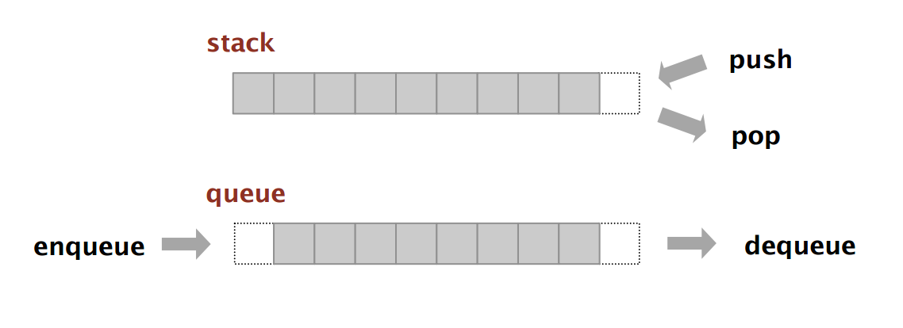

## Pilas y Colas

### El problema

Se pide modelar en el paradigma de objetos dos tipos colecciones que se comporten como las estructuras de datos Pila y Cola. Para ambos tipos de colección, nos interesará que sus instancias entiendan los siguientes mensajes:

- `void agregar(Object)`: agrega un elemento al principio o final de la colección, según la colección sea una pila o cola. 
- `void sacar()`: saca el primer elemento de la colección. Si la colección está vacía, lanza una excepción. 
- `Object tope()`: devuelve el primer elemento de la colección, sin removerlo. Si la colección está vacía, lanza una excepción.

Las restricciones son las siguientes:

- No está permitido usar ningún if
- Un objeto debe poder utilizar indistintamente una u otra colección (aunque cambiará el orden en que los elementos son devueltos al sacarlos)
- No debe haber lógica repetida (para variar!)
- Salvo tope Los mensajes anteriores deben modificar la colección original (tienen efecto) 

### Casos de Prueba

- Si se agrega un elemento a una colección vacía y luego se lo saca, el elemento devuelto es el mismo que el original
- Si se agregan tres elementos a, b, c a una pila, y se los extrae, se obtienen los elementos c, b, a, en ese orden. 
- Si se agregan tres elementos a, b, c a una cola, y se los extra, se obtienen los elementos a, b, c en ese orden 
- Si se saca un elemento de una colección vacía, se lanza una excepción

### Bonus(es)

- Implementar ambas colecciones de forma que los elementos sean genéricos (los tipos estén parametrizados según el tipo de elemento)
- Implementar un mensaje int longitud(). Pensar y escribir al menos tres casos de prueba antes de empezar a codificar. 
- Implementar un mensaje de orden superior que ejecute un cierto código parametrizable para cada elemento de la colección. ¿Cual debería ser la firma de este mensaje?

## Links

- [Volver a ejercicios introductorios](index.md)
- Siguiente ejercicio: 